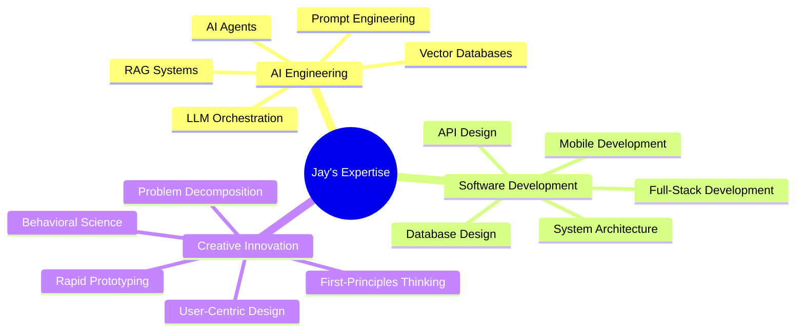

# Hi there, I'm Jay! 👋 

  

  

---

## 🧠 About Me

> *"I see problems as puzzles waiting to be solved from the ground up."*

I'm an **AI Engineer** and **Creative Technologist** who believes in understanding systems from their very foundation. My passion lies in pushing the boundaries of what's possible with AI, turning complex theoretical concepts into practical solutions that make a real difference.

🎯 **Current Focus**: AI Agent Systems, LLM Orchestration, and Behavioral AI Applications  
🚀 **Mission**: Building AI systems that truly understand and assist human cognition  
🔬 **Approach**: First-principles thinking meets creative experimentation  
🌟 **Recognition**: Google Hackathon Top Submission Winner  

---

## 🔥 What Makes Me Different

### 🧩 The Structured Context Board Innovation
I invented a novel approach to AI attention management - the **Structured Context Board (SCB)** - an external mechanism that dynamically manages LLM attention by reducing the "haystack" to what's truly necessary. This isn't just another RAG implementation; it's a fundamental rethinking of how AI agents maintain context.

### 🎨 Creative Problem Solver
My ADHD-powered creative mind and insatiable curiosity drive me to explore every corner of technology. I don't just use tools - I reimagine them, combine them, and sometimes invent entirely new approaches.

### 🏗️ Foundation-First Builder
I believe in understanding problems at their core before building solutions. This philosophy has led me to create everything from AI tutors to behavioral intervention apps, each addressing fundamental human needs.

---

## 🚀 Featured Projects

<strong>🤖 Integrated Development Agent (IDA)</strong> - Revolutionary AI Coding Assistant

**The Problem**: Current AI coding assistants lack persistent, holistic context awareness  
**My Solution**: Built an autonomous agent with the Structured Context Board mechanism

**Key Innovation**: Unlike traditional RAG systems that fetch discrete chunks, SCB provides complete, structured project context for every decision

**Tech Stack**: `Python` `LangChain` `Streamlit` `LLMs`

**What it does**:
- 🎯 Translates high-level goals into executable task hierarchies
- 💭 Maintains holistic project understanding across all files
- 🔄 Enables Human-in-the-Loop intervention at any stage
- 📊 Reduces context switching and improves code coherence

<strong>🎓 AI Study Buddy</strong> - Personalized Learning Revolution

**The Problem**: Private tutoring is expensive; generic learning is ineffective  
**My Solution**: Created an AI tutor that adapts to individual learning styles

**Achievement**: 🏆 **Top Submission at Google GenAI Exchange Hackathon**

**Tech Stack**: `Python` `Streamlit` `FAISS` `LangChain`

**What it does**:
- 📚 Generates personalized learning roadmaps from any syllabus
- 🧠 Creates adaptive quizzes with reinforcement learning principles
- 💡 Uses analogies and examples tailored to individual understanding
- 📈 Focuses on knowledge retention through spaced repetition

<strong>📱 Liv2Day</strong> - Behavioral Science Meets Technology

**The Problem**: Gap between long-term goals and daily action  
**My Solution**: Mobile app applying Cognitive Behavioral Therapy principles

**Tech Stack**: `Flutter` `Firebase` `Gemini AI`

**Innovation**: Proactive intervention engine that identifies emotional blockers and provides personalized nudges

**Features**:
- 🎯 Goal-setting with micro-habit formation
- 🔔 Smart notification system with behavioral triggers
- 📊 Pattern recognition for personalized insights
- 🧘 CBT-inspired intervention strategies

<strong>🏢 JustOfis Workspace Platform</strong> - Full-Stack Marketplace

**The Vision**: Democratize access to flexible workspace solutions

**Tech Stack**: `React` `Node.js` `MongoDB` `Google Maps API` `Firebase`

**Features**:
- 🗺️ Interactive map integration with real-time listings
- 🔍 Advanced filtering and search capabilities
- 📱 Responsive design with Material-UI
- 🔐 Secure authentication and user management

<strong>💬 Universal Context Engine</strong> - Unified Data Understanding

**The Challenge**: Extracting context from diverse file formats is complex  
**My Solution**: Universal RAG pipeline that handles any data type

**Tech Stack**: `Python` `Embedchain` `Gemini` `Selenium`

**Capabilities**:
- 📄 Process PDFs, websites, code repositories
- 🧠 Create unified vector embeddings
- 💬 Enable conversational querying across all formats
- 🔄 Dynamic context adaptation

---

## 🛠️ Tech Arsenal

### 🤖 AI & Machine Learning

### 🌐 Full-Stack Development

### ☁️ Cloud & DevOps

---

## 🎯 Core Expertise

---

## 📊 GitHub Analytics

  
  

  

---

## 🌟 Philosophy & Approach

> **"Every complex problem is just a series of simple problems in disguise."**

### 🔍 My Methodology:
1. **Understand the Foundation** - Break down problems to their core principles
2. **Question Everything** - Challenge assumptions and conventional approaches  
3. **Experiment Fearlessly** - Rapid prototyping and iterative improvement
4. **Build for Humans** - Technology should enhance human capabilities
5. **Think in Systems** - Consider interconnections and emergent behaviors

### 🧠 What Drives Me:
- **Curiosity**: Constant learning and exploration of new technologies
- **Impact**: Building solutions that genuinely improve people's lives
- **Innovation**: Finding novel approaches to age-old problems
- **Growth**: Continuous self-improvement and skill development

---

## 🎓 Education & Background

**🏛️ Delhi Technological University (DTU)**  
*B.Tech in Computer Engineering* | 2021-2025  
*New Delhi, India*

**💡 Entrepreneurial Spirit**  
Passionate about turning ideas into reality - from concept to prototype to potential product

---

## 🤝 Let's Connect!

I'm always excited to discuss:
- 🤖 AI/ML innovations and emerging technologies
- 🚀 Startup ideas and entrepreneurial ventures  
- 🧠 Behavioral science applications in technology
- 🛠️ Creative problem-solving approaches
- 📚 Knowledge sharing and collaborative learning

  
**Ready to build something amazing together?**  
*Let's turn your next big idea into reality!*

---

  

  
*"The best way to predict the future is to invent it."* - Alan Kay

