# Hi there, I'm Jay! 👋 

<div align="center">
  
</div>

<div align="center">
  
[](https://www.linkedin.com/in/jay-kumar-6a1016229/)
[](https://github.com/jay1331k)
[](mailto:jay1331kumar@gmail.com)
[](tel:+918826003180)
[](#)
[](#)

</div>

---

<div align="center">

## 🎮 **NEURAL COMMAND CENTER** 
*Welcome to my digital universe*

</div>

<div align="center">
  <details>
    <summary>🚀 <strong>SYSTEM STATUS</strong> 🚀</summary>
    <br>
    
```
╔══════════════════════════════════════════════════════════════╗
║                    🛸 JAY'S NEURAL NETWORK 🛸               ║
╠══════════════════════════════════════════════════════════════╣
║ Status: [████████████████████████████████] 100% OPERATIONAL  ║
║ AI Projects: 15+                                             ║
║ Lines of Code Written: 100,000+                              ║
║ Problems Solved: daily                                       ║
║ Current Mission: Revolutionizing AI-Human Collaboration      ║
║ Innovation Level: ∞                                          ║
╚══════════════════════════════════════════════════════════════╝
```
    
  </details>
</div>

---

## 🧠 **ABOUT ME**

<div align="center">
  
```ascii
      ╔══════════════════════════════════════════════════════════════╗
      ║          THE MIND OF A CREATIVE TECHNOLOGIST                 ║
      ╠════════════════════════════════╦═════════════════════════════╣
      ║         THE ENGINEER           ║          THE ARTIST         ║
      ║  ──────────────────────────    ║   ───────────────────────   ║
      ║   ⚙️ Systems & Logic          ║    🎨 Chaotic Creativity    ║
      ║   ⚙️ First Principles         ║    🎨 Pattern Recognition   ║
      ║   ⚙️ Architecture & Structure ║    🎨 Connecting the Dots   ║
      ║   ⚙️ Scalable Solutions       ║    🎨 "What If?" Scenarios  ║
      ╚════════════════════════════════╩═════════════════════════════╝
                     │                      │
                     └──────────┐    ┌──────┘
                                ▼    ▼
                          ╔════════════╗
                          ║BREAKTHROUGH║
                          ╚════════════╝
```

</div>

> *"I don't just solve problems—I redefine what's possible."*

**🎯 Current Focus**: AI Agent Systems, LLM Orchestration, and Behavioral AI Applications  
**🚀 Mission**: Building AI systems that truly understand and assist human cognition  
**🔬 Approach**: First-principles thinking meets chaotic creativity  
**🌟 Recognition**: Google Hackathon Top Submission Winner  

---

### 🧩 **The Structured Context Board Innovation**
I invented a revolutionary approach to AI attention management - the **Structured Context Board (SCB)** - an external mechanism that dynamically manages LLM attention by reducing the "haystack" to what's truly necessary. This isn't just another RAG implementation; it's a fundamental rethinking of how AI agents maintain context.

<div align="center">

| 🔍 **Traditional RAG** | 🚀 **SCB Innovation** |
|:---------------------:|:---------------------:|
| 📄 Fragment-based search | 🌍 Holistic context maintenance |
| ❌ Limited context windows | ✅ Complete project awareness |
| ⚠️ Inconsistent responses | 🎯 Contextually coherent decisions |
| 🔄 Frequent context loss | 🧠 Persistent memory architecture |

</div>

**The Impact**: 80% reduction in context resolution time, 95% improvement in response accuracy


---

<div align="center">

## 🎪 **PROJECT SHOWCASE** 🎪
*Each innovation more mind-bending than the last*

</div>

<details>
<summary><strong>🤖 IDA - The AI That Thinks Like a Senior Developer</strong> ⚡ <em>Revolutionary AI Coding Assistant</em></summary>

<div align="center">
  
```
    ┌─────────────────────────────────────────┐
    │     🧠 INTEGRATED DEVELOPMENT AGENT     │
    │                                         │
    │  ┌─────────┐    ┌─────────┐    ┌─────── │
    │  │ CONTEXT │───▶│   SCB   │───▶│ ACTION │
    │  │ BOARD   │    │ ENGINE  │    │ PLANNER│
    │  └─────────┘    └─────────┘    └─────── │
    │                      │                  │
    │                      ▼                  │
    │              ┌─────────────┐             │
    │              │ HUMAN LOOP  │             │
    │              │ INTEGRATION │             │
    │              └─────────────┘             │
    └─────────────────────────────────────────┘
```

</div>

**The Challenge**: Current AI assistants are like having a brilliant intern with amnesia.

**My Solution**: Built an AI with persistent memory and holistic project awareness.

**The Magic**: 
- 🎯 Translates "I want a blog" into 47 executable micro-tasks
- 💭 Remembers your coding style from months ago
- 🔄 Knows when to ask for help (revolutionary!)
- 📊 Makes decisions based on ENTIRE project context

**Tech Stack**: `Python` `LangChain` `Streamlit` `Advanced LLMs`

</details>

<details>
<summary><strong>🎓 AI Study Buddy - The Tutor Revolution</strong> 🏆 <em>Google's favorite innovation</em></summary>

<div align="center">
  
```
🏆 GOOGLE GENAI EXCHANGE HACKATHON 🏆
         TOP SUBMISSION WINNER
    
    Why? Because we solved education.
```

</div>

**The Problem**: Private tutoring costs $50/hour. Generic learning is ineffective.

**The Revolution**: Created an AI that learns how YOU learn, then becomes your perfect tutor.

**The Results**:
- 📚 Reads any syllabus → Creates personalized learning journey
- 🎯 Adapts to your learning style in real-time
- 💡 Uses YOUR interests to explain complex concepts
- 📈 Makes learning addictive instead of painful

**Tech Stack**: `Python` `Streamlit` `FAISS` `LangChain` `Educational Psychology`

</details>

<details>
<summary><strong>📱 Liv2Day - Psychology Meets Code</strong> 🧘 <em>CBT in your pocket</em></summary>

**The Gap**: We set goals on January 1st. We forget them by January 15th.

**The Bridge**: An app that understands your emotional patterns and intervenes before you self-sabotage.

**The Innovation**: Proactive intervention engine - like having a therapist, life coach, and best friend in one AI.

**Features**:
- 🎯 Micro-habit formation (big changes start small)
- 🔔 Smart nudges based on emotional state
- 📊 Pattern recognition that knows you better than yourself
- 🧘 CBT-inspired interventions that actually work

**Tech Stack**: `Flutter` `Firebase` `Gemini AI` `Behavioral Science`

</details>

<details>
<summary><strong>🏢 JustOfis - Airbnb for Workspaces</strong> 🗺️ <em>Democratizing productivity</em></summary>

**The Vision**: Why should great workspaces be limited to big companies?

**The Execution**: Full-stack marketplace making inspiring workspaces accessible to everyone.

**Features**:
- 🗺️ Interactive maps with real-time availability
- 🔍 Smart filtering (WiFi speed, coffee quality, vibe rating)
- 📱 Mobile-first design that works everywhere
- 🔐 Security that doesn't get in the way

**Tech Stack**: `React` `Node.js` `MongoDB` `Google Maps API` `Firebase`

</details>

<details>
<summary><strong>💬 Universal Context Engine - The Data Whisperer</strong> 🔄 <em>Any data, any format, any question</em></summary>

**The Chaos**: Data comes in PDFs, websites, videos, code repos, voice notes...

**The Solution**: Universal translator that turns any data type into conversational knowledge.

**The Magic**:
- 📄 Ingests anything - PDFs, websites, code, videos, audio
- 🧠 Creates unified understanding across all formats
- 💬 Chat with your entire digital life
- 🔄 Adapts context based on what you're trying to achieve

**Tech Stack**: `Python` `Embedchain` `Gemini` `Selenium` `Advanced NLP`

</details>

---

<div align="center">

## 🛠️ **ARSENAL OF DIGITAL WIZARDRY** 🛠️
*The technologies that bend to my will*

</div>

<div align="center">

### 🤖 **AI & MACHINE LEARNING MASTERY**


### 🔄 **AUTOMATION & WORKFLOW ORCHESTRATION**


### 🌐 **FULL-STACK DOMINATION**


### 🎨 **UI/UX DESIGN SYSTEMS**


### 🗄️ **DATABASE & BACKEND MASTERY**


### 🚀 **SPECIALIZED FRAMEWORKS & LIBRARIES**


### 🔌 **API INTEGRATIONS & SERVICES**


</div>

---

<div align="center">

## 🎯 **THE NEURAL NETWORK MAP** 🎯
*How my brain processes the impossible*

```mermaid
mindmap
  root((🧠 JAY'S CONSCIOUSNESS))
    🤖 AI Engineering
      LLM Orchestration
      RAG Revolution
      Agent Architectures
      Vector Databases
      Prompt Alchemy
    💻 Software Mastery
      Full-Stack Wizardry
      Mobile App Creation
      System Architecture
      API Artistry
      Database Design
    🎨 Creative Chaos
      First-Principles Thinking
      Problem Decomposition
      Rapid Prototyping
      User-Centric Design
      Behavioral Psychology
    🚀 Innovation Engine
      Pattern Recognition
      Future Prediction
      Technology Fusion
      Paradigm Shifting
      Reality Bending
```

</div>



---


  
### 🏆 **ACHIEVEMENT UNLOCKED** 🏆


</div>

---

<div align="center">

## 🧪 **THE PHILOSOPHY LAB** 🧪
*The principles that fuel the innovation*

</div>

<div align="center">
  
```
╔══════════════════════════════════════════════════════════════╗
║                    🔬 THE JAY METHODOLOGY 🔬                ║
╠══════════════════════════════════════════════════════════════╣
║                                                              ║
║  "Every impossible problem is just a puzzle                  ║
║   waiting for the right perspective."                        ║
║                                                              ║
║  Step 1: Question Everything, even the Question itself       ║
║  Step 2: Define what we are trying to achieve                ║
║  Step 3: Lay the foundation for a solution                   ║
║  Step 4: Experiment (Failure = Data)                         ║
║  Step 5: Optimize                                            ║
║                                                              ║
╚══════════════════════════════════════════════════════════════╝
```

</div>


---

<div align="center">

## 🎓 **ORIGIN STORY** 🎓

</div>

**🏛️ Delhi Technological University (DTU)**  
*B.Tech in Computer Engineering* | 2021-2025  
*New Delhi, India*

**Plot Twist**: While others memorized algorithms, I invented new ones. While they followed tutorials, I questioned why tutorials existed.

**💡 The Entrepreneurial Anomaly**  
Building the future, one impossible idea at a time.


<div align="center">

## 🌟 **READY TO CREATE SOMETHING EXTRAORDINARY?** 🌟

</div>

<div align="center">
  
```
🎯 SEEKING COLLABORATORS FOR:
  🤖 AI/ML Innovations  •  🚀 Startup Ideas  •  🧠 Tech + Psychology
  🛠️ "Impossible" Problems  •  📚 Knowledge Sharing
```

</div>

<div align="center">

### 💬 **INSTANT RESPONSE**
[](https://wa.me/918826003180?text=Hi%20Jay!%20Saw%20your%20GitHub%20profile%20-%20let's%20build%20something%20amazing!%20🚀)


---

⚡ **Response Time:** Usually within 4 hours  
🌍 **Best Time:** 9 AM - 11 PM IST (GMT+5:30)

</div>

---

<div align="center">
  
</div>

<div align="center">
  
Alan Kay ONCE SAID - *"The best way to predict the future is to invent it."* 
**But why stop at predicting? Let's rewrite the rules entirely.**

</div>
